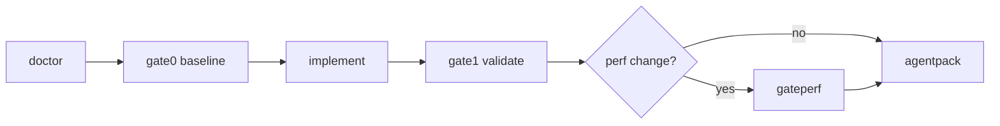

# Agent Gates — Memex Core

Thin PowerShell validation cockpit for coding agents. Keeps human and agent verification reproducible without touching application source.

## Entry point

```powershell
pwsh ./scripts/memex-gate.ps1 <command>
```

## Gate semantics

| Gate | When to run | What it proves |
|------|-------------|----------------|
| **gate0** | **Before** any agent intervention | Baseline locale saine : `check` + `test` passent sur l’état actuel du repo |
| **gate1** | **After** agent changes | Même chaîne que gate0 — confirme que l’intervention n’a pas cassé le repo |
| **gateperf** | Only when perf-sensitive code changed | `npm run bench` uniquement — pas de `check`/`test` |

`gate0` et `gate1` exécutent aujourd’hui la même chaîne (`npm run check` puis `npm test`). La distinction est **temporelle** : baseline vs post-intervention. `gateperf` est isolé pour les changements FTS, context-pack ou ranking.

## Commands

### `doctor`

Pre-flight checks before any implementation work.

- Node.js and npm on `PATH`
- `node_modules/` present
- Required repo files (`package.json`, `src/`, `tests/`, `AGENTS.md`, this doc, `scripts/memex-gate.ps1`)
- `package.json` exposes `check`, `test`, and `bench` scripts

Emits JSON to stdout. When `node_modules` is missing, includes `"suggested_action": "Run npm install"`.

Writes:

- `.agent-handoff/doctor-<timestamp>.log`
- `.agent-handoff/latest-doctor.log` (stable pointer to the last run)

Exit `0` = healthy, `1` = fix blockers first.

### `gate0`

**Baseline locale avant intervention agent.**

1. `npm run check` — syntax check across `src/` modules
2. `npm test` — full Node test runner suite

Run **before** you edit `src/` or `tests/` to capture a known-good snapshot.

Logs: `gate0-<timestamp>.log` + `latest-gate0.log`.

### `gate1`

**Validation après intervention agent.**

1. `npm run check`
2. `npm test`

Run **after** your changes, before handoff or commit. Same commands as gate0; compares against the mental baseline from gate0.

Logs: `gate1-<timestamp>.log` + `latest-gate1.log`.

### `gateperf`

**Performance seulement** — no syntax or test gate.

1. `npm run bench` — read-path benchmark (`bench/read-path.bench.ts`)

Run when touching vault FTS, context-pack assembly, or search ranking. Do not substitute for gate1.

Logs: `gateperf-<timestamp>.log` + `latest-gateperf.log`.

### `agentpack`

Generates handoff artifacts for the next agent:

| File | Purpose |
|------|---------|
| `.agent-handoff/memex_status.md` | Repo version, branch, last gate results |
| `.agent-handoff/agent_prompt.md` | Copy-paste prompt with constraints and commands |

Also appends to `.agent-handoff/manifest.json` (last 30 runs).

Logs: `agentpack-<timestamp>.log` + `latest-agentpack.log`.

### `clean`

Removes generated logs (including `latest-*.log`), manifest, and handoff markdown. Safe to run anytime; does not delete source code.

## Log layout

```
.agent-handoff/
  doctor-20260704-115000.log      # horodaté (historique)
  latest-doctor.log               # dernier doctor (stable)
  gate0-20260704-115130.log
  latest-gate0.log
  gate1-20260704-120500.log
  latest-gate1.log
  gateperf-20260704-121000.log
  latest-gateperf.log
  agentpack-20260704-115200.log
  latest-agentpack.log
  manifest.json
  memex_status.md
  agent_prompt.md
```

All gate commands append structured entries to `manifest.json` with UTC timestamp, pass/fail, and absolute log path.

## Recommended workflow



## What this deliberately excludes

- **ProofLoop Python** — out of scope for memex-core
- **Modifications to `src/` or `tests/`** — the gate script only orchestrates npm
- **PR #10** — no dependency or merge assumption

## Troubleshooting

| Symptom | Fix |
|---------|-----|
| `node_modules missing` | `npm install` (doctor JSON includes `suggested_action`) |
| `check` fails | Fix TypeScript/syntax errors in listed `src/` files |
| `test` fails | Read failing test name; fix behavior or update test intentionally |
| `bench` slow or fails | Ensure SQLite/FTS fixtures; see `README.md` benchmark section |
| Empty manifest in `agentpack` | Run `doctor`, `gate0`, and `gate1` first so last-run table is populated |

## Related

- [AGENTS.md](../AGENTS.md) — agent operating instructions
- [TEST_INFRA.md](../TEST_INFRA.md) — test philosophy
- [README.md](../README.md) — `npm test` and `npm run bench` expectations
